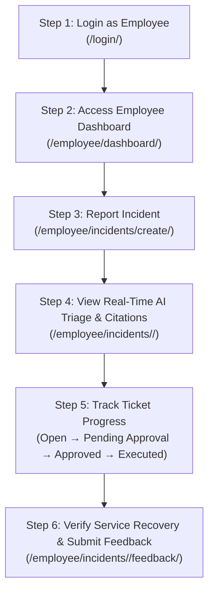
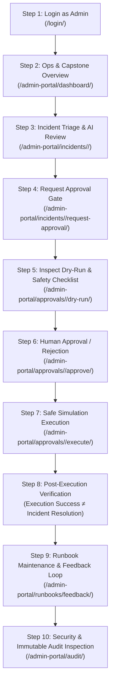

# AIOps Service Desk — Two-Sided Operational Workflow Guide
## Comprehensive Step-by-Step Manual: Employee Portal vs. IT Administrator Portal

**Project Title**: AIOps Service Desk with Runbook Retrieval, Safe Automation & Human Approval  
**Architecture Paradigm**: Dual-Portal Architecture with Human-in-the-Loop Safety Gateways  
**Document Purpose**: Definitive reference detailing every user action, system response, safety check, and operational workflow from both the **Employee Side** and the **Admin/Approver Side**.

---

## 1. Quick Reference & Dual-Role Comparison Matrix

| Attribute | Employee Side (End User) | IT Administrator Side (Approver / Engineer) |
| :--- | :--- | :--- |
| **Primary Goal** | Fast incident reporting, transparent status tracking, self-service issue closure feedback. | Incident governance, AI retrieval validation, pre-execution safety gating, safe remediation execution. |
| **Default User Account** | `employeee` / `employeee1234` | `admin` / `admin1234` |
| **Portal Base URL** | `http://127.0.0.1:8000/employee/` | `http://127.0.0.1:8000/admin-portal/` |
| **Key Dashboard** | `/employee/dashboard/` | `/admin-portal/dashboard/` & `/admin-portal/project-overview/` |
| **Incident Scope** | View and create only own reported tickets. | Global visibility across all organization tickets and queue filters. |
| **AI / NLP View** | Read-only recommendations and plain-language citations. | Full AI confidence score ($\tau \ge 0.45$), vector matches, and cited technical steps. |
| **Safety & Dry-Run** | View remediation proposal summary. | Execute 7-point diagnostic checks, trigger read-only dry-runs, view rollback plans. |
| **Approval Authority** | **None** (Cannot approve or reject automation). | **Full Authority** (Sole role empowered to approve or reject remediation requests). |
| **Execution Authority** | **None** (Execution buttons are inaccessible). | **Authorized Execution** (Triggers safe simulated remediation via Python handlers). |
| **Post-Execution Role**| Confirms actual business service recovery; submits star rating & feedback. | Performs technical verification (*Execution Success $\neq$ Incident Resolution*); closes ticket. |
| **Audit Logs** | Hidden (Zero access to administrative logs). | Full access to immutable event audit records (`/admin-portal/audit/`). |

---

## 2. The Employee Side: Step-by-Step Workflow



### Step 1: Authentication & Access
- **Action**: Navigate to `http://127.0.0.1:8000/login/`.
- **Credentials**: Enter username `employeee` and password `employeee1234`.
- **System Response**: System authenticates the user, detects the `EMPLOYEE` role, and automatically redirects to `/employee/dashboard/`.

### Step 2: Employee Dashboard Overview
- **Action**: Visit `/employee/dashboard/`.
- **What You See**:
  - **Metric Counters**: Total Incidents Reported, Open Tickets, Tickets in Progress, Resolved Tickets.
  - **Recent Incidents Table**: Overview of past reported issues with status badges (`OPEN`, `PENDING_APPROVAL`, `RESOLVED`).
  - **Quick Action Button**: `+ Report Incident`.

### Step 3: Reporting an Incident Ticket
- **Action**: Click the **Report Incident** button (or navigate to `/employee/incidents/create/`).
- **Input Fields**:
  - **Title**: Short summary of the outage (e.g., `Production Web Server returning 502 Bad Gateway`).
  - **Category**: Select category from dropdown (`Server`, `Database`, `Network`, `Security`, `Application`).
  - **Priority**: Select urgency (`Low`, `Medium`, `High`, `Critical`).
  - **Description**: Detailed description of observed symptoms (e.g., `Users cannot load the portal. Nginx returns HTTP 502 Bad Gateway. Connection refused on port 80/443 after new deployment.`).
- **Submit**: Click **Submit Incident**.
- **System Action Behind the Scenes**:
  - Validates and sanitizes inputs against XSS and injection.
  - Ingests ticket into the SQLite database.
  - Triggers **Local NLP Deterministic Normalizer**: extracts Intent (`Service Outage`), Target Service (`Web Server`), and Suggested Priority (`P1`).
  - Triggers **scikit-learn TF-IDF + Cosine Similarity Pipeline**: vectorizes description and computes similarity against canonical runbook corpus.
  - If similarity $\ge 0.45$, attaches top matching runbook (e.g., `RB-0001: Restart Nginx Web Server`) along with cited symptoms and steps.

### Step 4: Reviewing AI Recommendations & Citations
- **Action**: View the newly created incident page (`/employee/incidents/<id>/`).
- **What You See**:
  - **Ticket Metadata**: Ticket ID (e.g., `INC-0004`), status badge (`OPEN`), creation timestamp.
  - **AI-Assisted Classification Card**:
    - Extracted Intent, Service, and System-Suggested Priority.
  - **Recommended Runbook Card**:
    - Runbook Title, Summary, and Confidence Level.
  - **Verifiable Citations Box**:
    - Displays exact matching symptom keywords (`502 Bad Gateway`, `Nginx connection refused`) and canonical resolution steps.
  - **Notice to Employee**: Informs the user that high-risk automated remediation requires human IT Administrator review before execution.

### Step 5: Tracking Ticket Progress in Real Time
- **Action**: Refresh or revisit `/employee/incidents/<id>/` as IT engineers work on the ticket.
- **Observed Transitions**:
  1. `OPEN` $\rightarrow$ Ticket received and triaged.
  2. `PENDING_APPROVAL` $\rightarrow$ IT Administrator has requested approval for an automated runbook action.
  3. `APPROVED` $\rightarrow$ IT Approver verified safety checks and granted execution authorization.
  4. `IN_PROGRESS` $\rightarrow$ Automated remediation is being executed in safe simulation mode.
  5. `RESOLVED` $\rightarrow$ Action successfully executed and verified.

### Step 6: Post-Resolution Verification & Continuous Feedback
- **Action**: Once the incident status changes to `RESOLVED`, a **Resolution & Feedback Card** unlocks on `/employee/incidents/<id>/`.
- **Form Inputs**:
  - **Rating**: Star rating scale from $1$ to $5$ stars.
  - **Resolution Comments**: Text input (e.g., `Web server is back online and portal loads fast. Excellent automated fix.`).
- **Submit**: Click **Submit Feedback**.
- **System Response**:
  - Feedback is saved and linked to both the `Incident` and the applied `Runbook`.
  - Aggregated rating updates the runbook's operational health score in the Admin Knowledge Base.

---

## 3. The IT Administrator Side: Step-by-Step Workflow



### Step 1: Authentication & Access
- **Action**: Navigate to `http://127.0.0.1:8000/login/`.
- **Credentials**: Enter username `admin` and password `admin1234`.
- **System Response**: Authenticates admin user and redirects to `/admin-portal/dashboard/`.

### Step 2: Live Operations & Capstone Overview
- **Action**: Review operations via `/admin-portal/dashboard/` and `/admin-portal/project-overview/`.
- **What You See**:
  - **System Metrics**: Total System Incidents, Open Critical Incidents, Pending Approvals Count, Executed Automations Count.
  - **Pending Approvals Queue**: Prominent alert highlighting any remediation actions awaiting human review.
  - **Phase 1 to 8 Compliance Matrix**: Academic verification tracker confirming that all architectural pillars are active and healthy.

### Step 3: Incident Triage & Explainable AI Inspection
- **Action**: Click on an incident from the queue (e.g., `/admin-portal/incidents/4/`).
- **Administrative Inspection**:
  - **NLP Confidence Evaluation**: Inspect the exact TF-IDF Cosine Similarity score (e.g., `0.74`). Compare against the threshold $\tau = 0.45$.
  - **Citation Verification**: Review the exact symptoms extracted from the ticket body against canonical runbook metadata.
  - **Risk Classification**: System flags the recommended action:
    - `LOW_RISK`: Read-only diagnostics (eligible for auto-approval if configured).
    - `HIGH_RISK`: Service restart, cache purge, or resource reallocation (strictly gated behind human approval).

### Step 4: Initiating the Human Approval Gate
- **Action**: On the incident detail page, click **Request Approval**.
- **System Action**:
  - Creates a formal `ApprovalRequest` record tied to the incident and the proposed action.
  - Changes incident status to `PENDING_APPROVAL`.
  - Emits an immutable log event to `SystemAuditTrail`.
  - Redirects admin to the **Human Review Panel** (`/admin-portal/approvals/<id>/`).

### Step 5: Pre-Execution Diagnostics & Dry-Run Preview
- **Action**: On `/admin-portal/approvals/<id>/`, inspect the pre-execution safety safeguards:
  1. **The 7-Point Live Diagnostic Checklist**:
     - [x] Runbook is in `ACTIVE` state.
     - [x] Proposed action is in the strict `SAFE_ACTIONS` allowlist.
     - [x] Action parameters are strictly validated (no shell characters `;`, `&`, `|`, `>`).
     - [x] Associated Incident is in `OPEN` or `PENDING_APPROVAL` status.
     - [x] No duplicate execution is currently active for this ticket.
     - [x] Human reviewer holds authenticated `STAFF` / `ADMIN` credentials.
     - [x] Target service is available in simulation registry.
  2. **Read-Only Dry-Run Inspection**:
     - Click **Open Full Dry-Run Inspection** (`/admin-portal/approvals/<id>/dry-run/`).
     - **Inspect**:
       - Expected impact (e.g., *“Simulates Nginx restart and connection port verification”*).
       - Zero OS command confirmation (verifies no `subprocess.Popen` or shell commands will be executed).
       - Rollback procedure instructions in case of verification failure.

### Step 6: Human Approval Decision Gate
- **Action**: Return to `/admin-portal/approvals/<id>/`.
- **Decision Pathways**:
  - **Pathway A — Approve**:
    - Enter review justification: `Approved for immediate simulated recovery during business hours.`
    - Click **Approve Action** (`/admin-portal/approvals/<id>/approve/`).
    - Status transitions to `APPROVED`. Unlocks the execution console.
  - **Pathway B — Reject**:
    - Enter mandatory rejection reason: `Action inappropriate; root cause identified as upstream DNS misconfiguration.`
    - Click **Reject Action** (`/admin-portal/approvals/<id>/reject/`).
    - Status transitions to `REJECTED`. Automation is permanently locked for this request.

### Step 7: Safe Automation Execution (Simulation Mode)
- **Action**: Click **Execute Approved Action** (`/admin-portal/approvals/<id>/execute/`).
- **Under the Hood Execution Safeguards**:
  - System executes the mapped Python handler strictly in-process (e.g., `simulate_restart_nginx()`).
  - Safe parameter substitution is enforced.
  - Standard output and exit codes (`0` for success) are recorded into `ActionLog`.
  - Real-time output displays:
    ```text
    [INFO] Starting safe simulated action: restart_service
    [INFO] Target: nginx.service
    [INFO] Checking service dependencies... OK
    [INFO] Reloading configuration files... OK
    [INFO] Restarting process safely... OK
    [SUCCESS] Nginx service restarted successfully. Exit code: 0
    ```

### Step 8: Post-Execution Verification (*Execution Success $\neq$ Incident Resolution*)
- **Core Capstone Axiom**: Even if an automation script exits with code `0`, the underlying incident is **NOT** automatically assumed resolved until post-execution diagnostic checks pass!
- **Action**: On the execution detail page (`/admin-portal/approvals/<id>/execution/`), click **Verify Execution** (`/admin-portal/approvals/<id>/verify/`).
- **System Verification Check**:
  - Executes post-remediation health check (e.g., confirms HTTP 200 return code on local endpoint).
  - Status updates to `PASSED`.
  - Ticket automatically updates to `RESOLVED` and sets `resolved_at = timezone.now()`.

### Step 9: Runbook Knowledge Base Management & Feedback Loop
- **Action**: Navigate to `/admin-portal/runbooks/` and `/admin-portal/runbooks/feedback/`.
- **Administrative Operations**:
  - **View Canonical Runbooks**: Inspect all active procedures, matched symptoms, and allowable actions.
  - **Create / Edit Runbooks**: Update runbook markdown procedures, add new keyword triggers, or toggle `is_active`.
  - **Review Employee Feedback**:
    - View employee star ratings and commentary submitted in Step 6 of the Employee workflow.
    - Click **Update Runbook** to refine procedures based on actual operational feedback.

### Step 10: Security, Audit Trail & Compliance Inspection
- **Action**: Navigate to `/admin-portal/audit/` (`admin_audit_log_list`).
- **Compliance Review**:
  - Inspect timestamped, immutable audit trail.
  - Columns: Timestamp, Actor (`admin`), Event Type (`APPROVAL_GRANTED`, `SIMULATION_EXECUTED`), Target Incident, IP Address, Details.
  - Guarantees non-repudiation and meets enterprise audit requirements.

---

## 4. End-to-End Side-by-Side Interaction Timeline

The table below traces a single incident through its entire lifecycle, displaying the simultaneous actions of the Employee, the System Backend, and the IT Administrator:

```
+---------------+------------------------+------------------------------------+--------------------------+
| Stage         | Employee Side          | Backend / AI Automation Engine     | Admin / Approver Side    |
+---------------+------------------------+------------------------------------+--------------------------+
| 1. Ingestion  | Submits ticket INC-004 | Ingests ticket; runs local TF-IDF; | Receives ticket in queue;|
|               | on /employee/incidents/| matches RB-0001 (score: 0.74);     | reviews suggested Intent |
|               | create/                | extracts citations & symptoms.     | and Runbook citations.   |
|               |                        |                                    |                          |
| 2. Gating     | Views status: OPEN;    | Validates action allowlist;        | Inspects 7-point checks; |
|               | reads plain-language   | prepares read-only dry-run preview | reviews dry-run preview; |
|               | recommended solution.  | and safety checklist.              | clicks "Approve Action". |
|               |                        |                                    |                          |
| 3. Execution  | Views status change:   | Dispatches in-process simulation;  | Clicks "Execute Action"; |
|               | IN_PROGRESS; sees fix  | captures logs; prevents OS shell   | monitors real-time       |
|               | is underway.           | execution; records ActionLog.      | simulation console.      |
|               |                        |                                    |                          |
| 4. Dual       | Verifies application   | Runs diagnostic verification;      | Clicks "Verify Execution"|
|    Resolution | is reachable again;    | verifies HTTP 200; marks ticket    | to formally confirm fix  |
|               | rates fix 5-stars.     | RESOLVED; updates runbook health.  | and close the loop.      |
+---------------+------------------------+------------------------------------+--------------------------+
```

---

## 5. Security & Permission Boundaries (RBAC Enforcement)

| Operation / Endpoint | Employee Permission | Administrator Permission | Security Guardrail Enforced |
| :--- | :---: | :---: | :--- |
| View Own Tickets (`/employee/incidents/`) | :white_check_mark: Allowed | :white_check_mark: Allowed | Object-level queryset filter (`user=request.user`) |
| View All System Tickets (`/admin-portal/incidents/`) | :x: **Blocked (403)** | :white_check_mark: Allowed | `@user_passes_test(is_admin)` decorator |
| Request Automation Approval | :x: **Blocked (403)** | :white_check_mark: Allowed | Role check + ticket ownership validation |
| Trigger Dry-Run Inspection (`.../dry-run/`) | :x: **Blocked (403)** | :white_check_mark: Allowed | Read-only simulation harness |
| Approve / Reject Automation (`.../approve/`) | :x: **Blocked (403)** | :white_check_mark: Allowed | Human-in-the-loop authorization gate |
| Execute Automation Script (`.../execute/`) | :x: **Blocked (403)** | :white_check_mark: Allowed | Strict `SAFE_ACTIONS` allowlist (Zero shell access) |
| Manage Runbooks (`/admin-portal/runbooks/`) | :x: **Blocked (403)** | :white_check_mark: Allowed | Staff access required for knowledge updates |
| Inspect Audit Logs (`/admin-portal/audit/`) | :x: **Blocked (403)** | :white_check_mark: Allowed | Immutable append-only audit trail |
| Submit Incident Feedback (`.../feedback/`) | :white_check_mark: Allowed | :white_check_mark: Allowed | One feedback entry per resolved incident |

---

## 6. Viva Presentation Walkthrough (3-Minute Demonstration)

When presenting this project to capstone examiners, follow this exact side-by-side script:

1. **Open Two Browser Windows**:
   - **Left Window (Employee)**: Log in as `employeee` (`/employee/dashboard/`).
   - **Right Window (Admin)**: Log in as `admin` (`/admin-portal/dashboard/`).

2. **Demonstrate Incident Creation (Left Window)**:
   - Click **Report Incident**. Enter title: `Production Web Server returning 502 Bad Gateway`.
   - Submit the ticket and highlight:
     > *“Observe that without any external AI APIs or cloud costs, our local scikit-learn TF-IDF engine instantly classified the intent as ‘Service Outage’ and retrieved Runbook RB-0001 with verifiable citations.”*

3. **Demonstrate Safety Gating & Dry-Run (Right Window)**:
   - Switch to the Admin window. Open the new incident.
   - Click **Request Approval**, then view the **Human Review Panel**.
   - Show examiners:
     > *“Before any script is executed, our system enforces a 7-point pre-execution diagnostic check and generates a read-only dry-run preview. No junior engineer or rogue model can bypass this gate.”*

4. **Approve and Execute (Right Window)**:
   - Click **Approve Action** with notes, then click **Execute Approved Action**.
   - Point out:
     > *“Automation executes strictly in simulation mode via in-process Python handlers. Zero OS shell commands or unlisted parameters are permitted.”*

5. **Demonstrate Verification & Feedback Loop (Both Windows)**:
   - In Admin window, click **Verify Execution**. Show that the ticket status updates to `RESOLVED` (*Execution Success $\neq$ Incident Resolution*).
   - In Employee window, refresh the page. Show the **Resolution & Feedback** form. Submit a 5-star rating.
   - Show how the feedback immediately reflects in the Admin Knowledge Base at `/admin-portal/runbooks/feedback/`.
   - Conclude:
     > *“This completes the closed-loop, safe AIOps service desk lifecycle.”*
