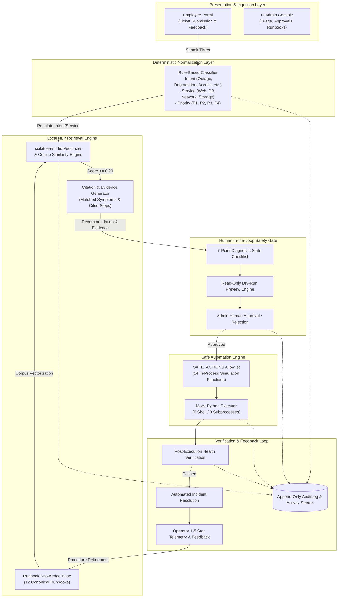
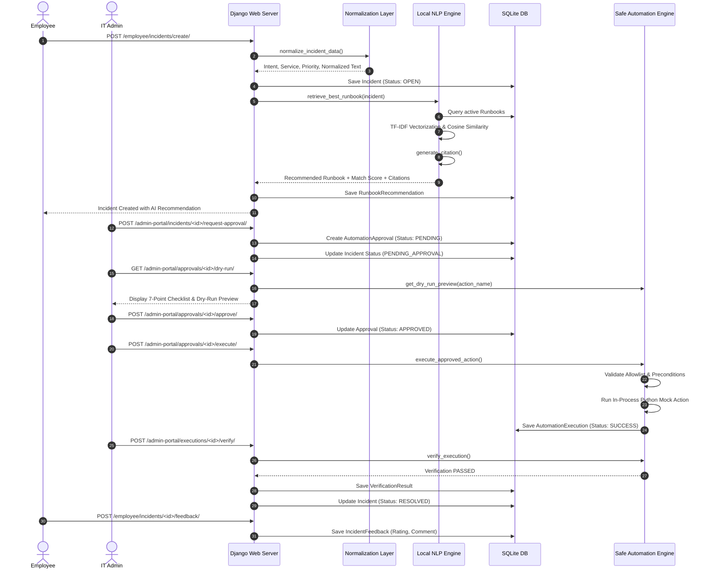

# System Architecture — AIOps Service Desk

## 1. Executive Architecture Summary

The **AIOps Service Desk with Runbook Retrieval, Safe Automation & Human Approval** is an enterprise-grade service management platform designed for resilient infrastructure operations. The architecture strictly rejects external AI dependencies (such as OpenAI, Gemini, or third-party cloud LLMs) in favor of **deterministic local ticket normalization**, **scikit-learn TF-IDF + Cosine Similarity runbook retrieval**, **verifiable citation evidence**, and **human-in-the-loop gated safe automation simulation**.

---

## 2. Core Architectural Components

### 2.1 Web Presentation & Security Boundary
- **Framework**: Django 6.0.7 MVC pattern.
- **Frontend**: Server-rendered HTML templates utilizing Bootstrap 5, Bootstrap Icons, and vanilla JavaScript.
- **Access Control**: Role-Based Access Control (RBAC) separating `EMPLOYEE` and `IT_ADMIN` personas via custom decorators (`@employee_required`, `@it_admin_required`). Object-level ownership prevents employees from viewing or rating tickets belonging to other users.

### 2.2 Deterministic Normalization & Triage Layer (`incidents/normalization.py`)
- Standardizes unstructured, noisy user ticket inputs prior to NLP retrieval.
- Evaluates regex token patterns to extract:
  - **Intent**: `Service Outage`, `Service Degradation`, `Access Issue`, `Database Issue`, `Network Issue`, `Storage Issue`, `Configuration Issue`, or `Unknown`.
  - **Service**: `Web Server`, `Database`, `Network`, `Storage`, `Authentication`, `Application`, or `Unknown`.
  - **Priority**: Algorithmic triage mapping (`P1` to `P4`) based on severity tokens and service criticalities.
- Synthesizes a canonical problem summary to remove conversational fluff and maintain uniform data quality.

### 2.3 Local NLP Runbook Retrieval Engine (`runbooks/retrieval.py`)
- **Technology**: `scikit-learn` `TfidfVectorizer` paired with linear cosine similarity (`cosine_similarity`).
- **Corpus Construction**: Dynamically builds document vectors across active runbooks by concatenating:
  $$\text{Document}_i = \text{Runbook.title} \parallel \text{Runbook.description} \parallel \text{Runbook.symptoms} \parallel \text{Runbook.category}$$
- **Thresholding**: Implements an operational minimum confidence cutoff ($\text{threshold} \ge 0.20$). Queries below this threshold return `None`, preventing low-confidence or hallucinated recommendations.
- **Citation Generation**: Deconstructs matched tokens against indicative runbook symptoms and extracts targeted resolution steps, guaranteeing transparent, explainable recommendations.

### 2.4 Pre-Automation Diagnostic Checklist & Dry-Run Engine (`automation/safety.py`, `actions.py`)
- Evaluates 7 live system safety checks before allowing automation:
  1. Incident has an attached runbook.
  2. Runbook is active in the catalog.
  3. Action identifier exists.
  4. Action is present in `SAFE_ACTIONS` allowlist.
  5. Target incident is currently open / eligible.
  6. Explicit human approval exists.
  7. Action is confirmed simulation-safe.
- Generates a **Dry-Run Simulation Preview** displaying expected output, reversibility status, and rollback instructions without mutating system or database state.

### 2.5 Safe Simulation Automation Engine (`automation/executor.py`, `actions.py`)
- **Strict Allowlist**: Only functions explicitly registered in `SAFE_ACTIONS` dictionary are permitted to run.
- **Simulation Guarantee**: Pure in-process Python callable functions. Completely prohibits `os.system`, `subprocess.Popen`, `shell=True`, `eval`, and `exec`.
- **Idempotency Guard**: Prevents duplicate executions on already succeeded approvals.

### 2.6 Post-Execution Verification Service (`automation/verification.py`)
- Simulates an independent operational health check validating service recovery.
- Upon passing, automatically transitions the incident to `RESOLVED` and populates `resolved_at`.
- Upon failure, leaves the incident open for human engineer takeover.

### 2.7 Continuous Feedback & Audit System (`incidents/models.py`, `automation/audit.py`)
- Captures post-resolution employee satisfaction ratings (1–5 stars) and qualitative feedback.
- Telemetry informs IT Admins on runbook clarity, accuracy, and procedure updates.
- Centralized `AuditLog` records tamper-evident chronological records of all operations.

---

## 3. End-to-End Incident Lifecycle Sequence Diagram

---

## 4. Key Architectural Decisions & Tradeoffs

| Architecture Decision | Chosen Approach | Rationale | Alternatives Rejected |
| :--- | :--- | :--- | :--- |
| **AI Retrieval Mechanism** | Local TF-IDF + Cosine Similarity (`scikit-learn`) | Zero external network calls, zero API token costs, air-gap compatible, deterministic scoring, fast sub-millisecond execution. | External LLM APIs (OpenAI, Gemini), cloud vector databases (Pinecone). |
| **Automation Strategy** | Pure Python In-Process Simulation | 100% safe for educational capstone review, eliminating accidental system damage, host compromise, or command injection vulnerabilities. | Real OS subprocesses (`bash`, `cmd.exe`), remote SSH agents, SaltStack/Ansible daemons. |
| **Ticket Triage** | Deterministic Regex & Keyword Rule Engine | Explainable, easily testable, highly reproducible, with zero hallucinations and fallback to `Unknown`. | Black-box deep learning classifiers, cloud prompt-based classification. |
| **Database Architecture** | SQLite for development & testing; PostgreSQL schema compatible | Self-contained, portable, zero-setup evaluation harness without external service dependencies. | Requiring live PostgreSQL/pgvector cluster for simple local run. |
| **Human Oversight** | Mandatory Human-in-the-Loop Review Gate | Regulatory compliance, preventing autonomous execution of risky procedures without engineer verification. | Autonomous unattended auto-execution. |
