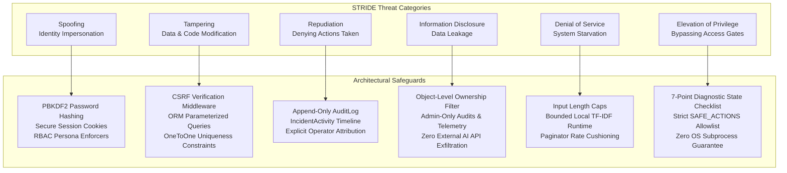

# Threat Model & Security Analysis (STRIDE) — AIOps Service Desk

This document provides a systematic threat analysis of the AIOps Service Desk platform using the **STRIDE** methodology (Spoofing, Tampering, Repudiation, Information Disclosure, Denial of Service, Elevation of Privilege).

---

## 1. System Threat Profile & Security Objectives

The primary security objectives of the AIOps Service Desk are:
1. Prevent unauthorized automation execution on infrastructure.
2. Maintain strict separation of privilege between Employees and IT Administrators.
3. Ensure tamper-evident logging and non-repudiation for all human review decisions.
4. Guarantee that simulated automation cannot escalate into arbitrary command execution or system compromise.
5. Eliminate data exfiltration risks by maintaining 100% local, air-gapped NLP processing.

---

## 2. STRIDE Threat Matrix & Mitigations

---

### 2.1 Spoofing (Identity Impersonation)
- **Threat Vector**: An attacker attempts to forge credentials or hijack an IT Administrator's active session to approve destructive actions.
- **Impact**: High — Unauthorized approval of automation.
- **Architectural Mitigations**:
  - Passwords hashed using PBKDF2 with SHA-256 (720,000 rounds).
  - Session cookies marked `HttpOnly` to block script-based extraction.
  - Access control decorators (`@it_admin_required`) rigorously validate user role against the database on every sensitive request.

### 2.2 Tampering (Data Modification)
- **Threat Vector**: An attacker intercepts requests to alter runbook procedures, manipulate match similarity scores, or modify approval records.
- **Impact**: High — Execution of unauthorized or altered remediation steps.
- **Architectural Mitigations**:
  - CSRF tokens required on all mutating requests (`POST`).
  - Strict model validations ensure Runbook editing is restricted solely to verified IT Admins.
  - Automation approvals are immutable once transitioned to `APPROVED` or `REJECTED`; double-approval and double-execution attempts are rejected.
  - 100% ORM parameterized queries eliminate SQL injection vectors.

### 2.3 Repudiation (Denying Past Actions)
- **Threat Vector**: An IT Administrator approves a faulty or controversial action and later denies having authorized it.
- **Impact**: Medium — Inability to perform post-incident forensics and hold personnel accountable.
- **Architectural Mitigations**:
  - Mandatory `reviewed_by` and `reviewed_at` timestamps recorded on every `AutomationApproval` entity.
  - `AuditLog` table records append-only entries capturing actor ID, timestamp, target incident, and operational metadata.
  - Incident timeline (`IncidentActivity`) provides an immutable chronological narrative of all user and system interventions.

### 2.4 Information Disclosure (Data Leakage)
- **Threat Vector**: An employee inspects incidents submitted by other employees, or sensitive system credentials/logs are leaked via external cloud AI APIs.
- **Impact**: Medium to High — Privacy breach and operational leakage.
- **Architectural Mitigations**:
  - Employee incident queries strictly enforce object-level ownership: `Incident.objects.filter(created_by=request.user)`.
  - Attempts to access unauthorized incident IDs return HTTP 404 or 403.
  - **Zero External AI APIs**: Air-gapped local `scikit-learn` TF-IDF implementation ensures that incident descriptions and infrastructure telemetry never leave the server memory boundary.

### 2.5 Denial of Service (System Starvation)
- **Threat Vector**: An attacker floods the system with massive ticket descriptions or rapid requests to overwhelm vectorization memory or database storage.
- **Impact**: Medium — System latency or temporary unavailability.
- **Architectural Mitigations**:
  - Django form validation enforces title length limits ($200$ characters).
  - TF-IDF vectorization operates strictly on localized, in-memory string tokens, terminating in under $10\text{ ms}$.
  - Pagination limits database query overhead to $10$ items per page across all catalog and incident views.

### 2.6 Elevation of Privilege (Access Escalation)
- **Threat Vector**: An unprivileged Employee sends direct HTTP POST requests to `/admin-portal/approvals/<id>/execute/` or modifies the `automation_action` parameter to execute arbitrary shell commands (e.g. `rm -rf /`).
- **Impact**: Critical — Host server takeover.
- **Architectural Mitigations**:
  - Endpoint decorators (`@it_admin_required`) block employee access with immediate HTTP 403 or redirect.
  - Even if an attacker bypassed web routing, the executor layer independently enforces the `SAFE_ACTIONS` allowlist.
  - **Zero Shell / Subprocess Execution**: The system utilizes pure in-process Python callable functions. Commands such as `rm`, `delete_database`, or shell scripts cannot execute because `subprocess`, `os.system`, `exec`, and `eval` are completely absent from the codebase.
